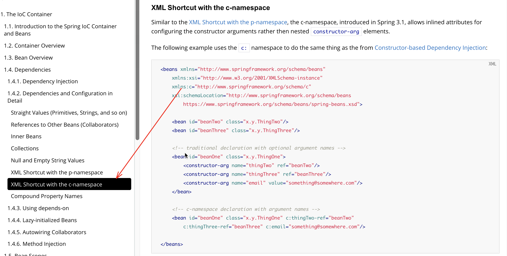
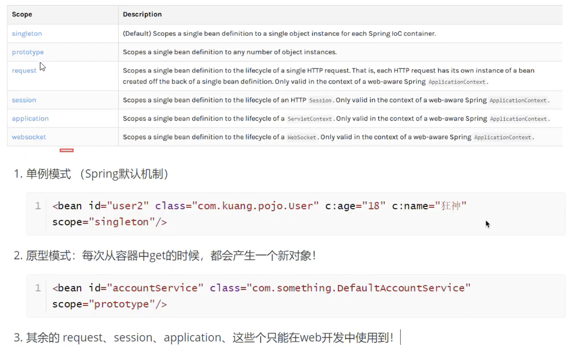
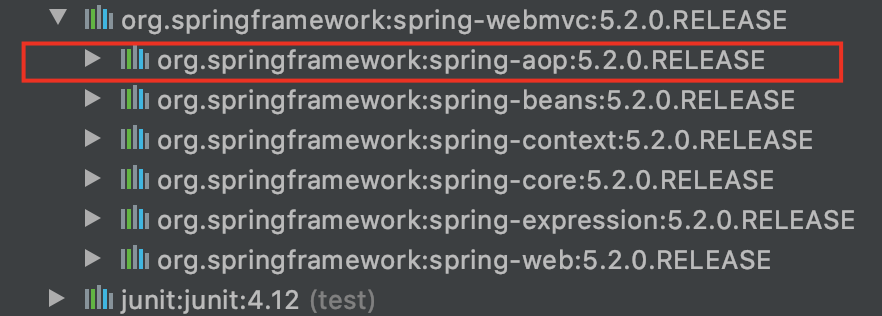
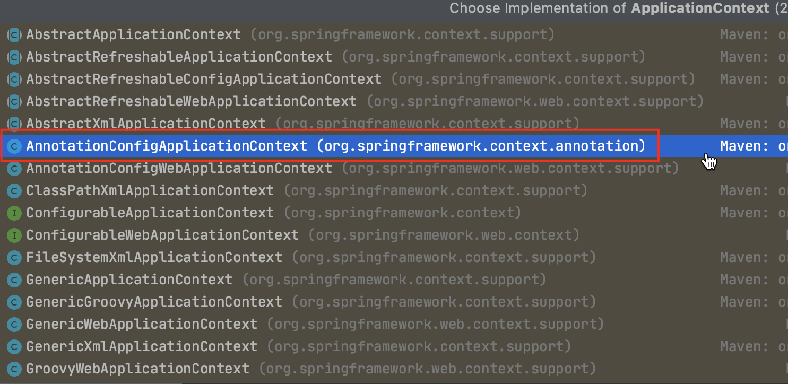
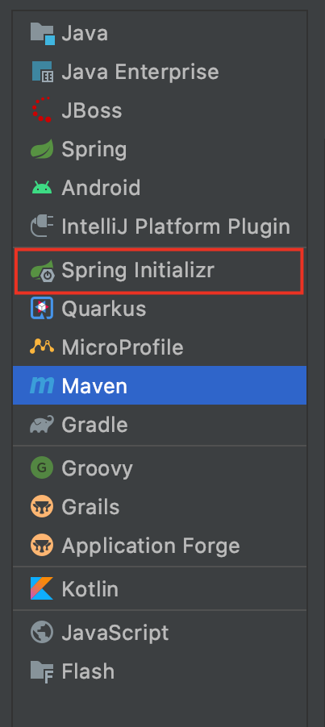

# Spring

## 1.1 Spring优点

- Spring是一个开源的、免费的框架（容器）！
- Spring是一个轻量级的、非入侵式的框架！
- 控制反转（IOC），面向切面编程（AOP）!
- 支持事务的处理，对框架整合的支持！


**总结一句话：Spring就是一个轻量级的控制翻转（IOC）和面向切面编程（AOP）的框架**


想随意调节B站倍速播放 ，谷歌浏览器按f12,点选console
输入 document.querySelector('video').playbackRate = 3;
按下回车即可3倍速播放，想要多少的速度自己调节


<div align="left" > 


[Spring介绍](https://developer.ibm.com/zh/articles/wa-spring1/)

组成 Spring 框架的每个模块（或组件）都可以单独存在，或者与其他一个或多个模块联合实现。每个模块的功能如下：

- **核心容器** ：核心容器提供 Spring 框架的基本功能。核心容器的主要组件是 `BeanFactory`，它是工厂模式的实现。 `BeanFactory` 使用 *控制反转* （IOC） 模式将应用程序的配置和依赖性规范与实际的应用程序代码分开。
- **Spring 上下文** ：Spring 上下文是一个配置文件，向 Spring 框架提供上下文信息。Spring 上下文包括企业服务，例如 JNDI、EJB、电子邮件、国际化、校验和调度功能。
- **Spring AOP** ：通过配置管理特性，Spring AOP 模块直接将面向方面的编程功能集成到了 Spring 框架中。所以，可以很容易地使 Spring 框架管理的任何对象支持 AOP。Spring AOP 模块为基于 Spring 的应用程序中的对象提供了事务管理服务。通过使用 Spring AOP，不用依赖 EJB 组件，就可以将声明性事务管理集成到应用程序中。
- **Spring DAO** ：JDBC DAO 抽象层提供了有意义的异常层次结构，可用该结构来管理异常处理和不同数据库供应商抛出的错误消息。异常层次结构简化了错误处理，并且极大地降低了需要编写的异常代码数量（例如打开和关闭连接）。Spring DAO 的面向 JDBC 的异常遵从通用的 DAO 异常层次结构。
- **Spring ORM** ：Spring 框架插入了若干个 ORM 框架，从而提供了 ORM 的对象关系工具，其中包括 JDO、Hibernate 和 iBatis SQL Map。所有这些都遵从 Spring 的通用事务和 DAO 异常层次结构。
- **Spring Web 模块** ：Web 上下文模块建立在应用程序上下文模块之上，为基于 Web 的应用程序提供了上下文。所以，Spring 框架支持与 Jakarta Struts 的集成。Web 模块还简化了处理多部分请求以及将请求参数绑定到域对象的工作。
- **Spring MVC 框架** ：MVC 框架是一个全功能的构建 Web 应用程序的 MVC 实现。通过策略接口，MVC 框架变成为高度可配置的，MVC 容纳了大量视图技术，其中包括 JSP、Velocity、Tiles、iText 和 POI。

Spring 框架的功能可以用在任何 J2EE 服务器中，大多数功能也适用于不受管理的环境。Spring 的核心要点是：支持不绑定到特定 J2EE 服务的可重用业务和数据访问对象。毫无疑问，这样的对象可以在不同 J2EE 环境 （Web 或 EJB）、独立应用程序、测试环境之间重用。


```java
   public void sayhello() {
       int i = 10;
   }
```


### 6 依赖注入

#### 6.1 构造器注入


#### 6.2 setter方式注入【重点】

*   依赖注入：set注入
    *   依赖：bean对象的创建依赖于容器
    *   注入：bean对象的所有属性，由容器来注入！

【环境搭建】

1.复杂环境

2.真实测试环境


#### 6.3 拓展方式注入

p-namespace：依赖set

c-namespace：依赖构造器




注意：不能直接使用，需要的时候去导入，官网直接拿即可。


#### 6.4 bean的作用域




### 7 Bean的自动装配

*   自动装配是Spring满足bean依赖的一种方式
*   spring会在上下文中自动寻找，并自动bean装配属性


在Spring 中有三种装配的方式

1.在xml文件中显示的装配

2.在java中显示装配

3.隐式的自动装配


#### 7.1 测试

环境搭建：一个人有两个宠物


#### 7.2 byName自动装配

```xml
	<bean id="cat" class="com.ly.pojo.Cat">
    </bean>

    <bean id="dog" class="com.ly.pojo.Dog">
    </bean>

<!--
    byName：会自动在容器的上下文中进行查找和自己set方法后面的值对应的bean-id！（名字要对应，且id要小写）
    -->
    <bean id="people" class="com.ly.pojo.People" autowire="byName">
        <property name="name" value="some one"/>
    </bean>
```

#### 7.3 byType自动装配

```xml
	<bean id="cat" class="com.ly.pojo.Cat">
    </bean>

    <bean class="com.ly.pojo.Dog">
    </bean>
<!--
    byName：会自动在容器的上下文中进行查找和自己set方法后面的值对应的bean-id！（名字要对应，且id要小写）
    byType：会自动在容器的上下文中进行查找和自己对象属性类型相同的bean！（需要类型全局唯一，bean id可以省略）
    -->
    <bean id="people" class="com.ly.pojo.People" autowire="byType">
        <property name="name" value="some one"/>
    </bean>
```

小结：

*   byName的时候，需要保证所有bean的id唯一，并且这个bean需要和自动注入的属性的set方法后面的值会一致（且id要小写）
*   byType的时候，需要保证所有bean的class唯一，并且这个bean需要和自动注入的属性的类型一致！

```xml
<?xml version="1.0" encoding="UTF-8"?>
<beans xmlns="http://www.springframework.org/schema/beans"
       xmlns:xsi="http://www.w3.org/2001/XMLSchema-instance"
       xmlns:context="http://www.springframework.org/schema/context"
       xsi:schemaLocation="http://www.springframework.org/schema/beans
        https://www.springframework.org/schema/beans/spring-beans.xsd">


    <bean id="cat" class="com.ly.pojo.Cat"/>
    <bean id="dog" class="com.ly.pojo.Dog"/>


<!--    &lt;!&ndash;原始配置方式&ndash;&gt;-->
<!--    <bean id="people" class="com.ly.pojo.People">-->
<!--        <property name="name" value="some one"/>-->
<!--        <property name="cat" ref="cat"/>-->
<!--        <property name="dog" ref="dog"/>-->
<!--    </bean>-->

    <!--使用autowired配置方式-->
    <!--
    byName：会自动在容器的上下文中进行查找和自己set方法后面的值对应的bean-id！（名字要对应，且id要小写）
    byType：会自动在容器的上下文中进行查找和自己对象属性类型相同的bean！（需要类型全局唯一，bean id可以省略）
    -->
    <bean id="people" class="com.ly.pojo.People" autowire="byName">
        <property name="name" value="some one"/>
    </bean>

</beans>
```


#### 7.4 使用注解实现自动装配

jdk 1.5支持注解，Spring2.5支持注解

The introduction of annotation-based configuration raised the question of whether this approach is “better” than XML. 

使用注解须知：

1、导入约束（context约束）：xmlns:context="http://www.springframework.org/schema/context"

2、配置注解的支持：<context:annotation-config/>

```xml
<?xml version="1.0" encoding="UTF-8"?>
<beans xmlns="http://www.springframework.org/schema/beans"
    xmlns:xsi="http://www.w3.org/2001/XMLSchema-instance"
    xmlns:context="http://www.springframework.org/schema/context"
    xsi:schemaLocation="http://www.springframework.org/schema/beans
        https://www.springframework.org/schema/beans/spring-beans.xsd
        http://www.springframework.org/schema/context
        https://www.springframework.org/schema/context/spring-context.xsd">

    <context:annotation-config/>

</beans>
```

**@Autowired**

直接在属性上使用即可，也可以在方法上使用（由于注解采用反射实现，可以没有set函数，所以建议放在属性上）

使用Autowired我们可以不用编写set方法，前提是你这个自动装配的属性在IOC（Spring）容器中存在，因为默认request参数为true

```xml
<?xml version="1.0" encoding="UTF-8"?>
<beans xmlns="http://www.springframework.org/schema/beans"
       xmlns:xsi="http://www.w3.org/2001/XMLSchema-instance"
       xmlns:context="http://www.springframework.org/schema/context"
       xsi:schemaLocation="http://www.springframework.org/schema/beans
        https://www.springframework.org/schema/beans/spring-beans.xsd
        http://www.springframework.org/schema/context
        https://www.springframework.org/schema/context/spring-context.xsd">

    <!--开启注解的支持-->
    <context:annotation-config/>

    <bean id="cat" class="com.ly.pojo.Cat"/>
    <bean id="dog" class="com.ly.pojo.Dog"/>
    <bean id="people" class="com.ly.pojo.People"/>

</beans>
```

注解通过反射实现，可以没有set方法

```java
package com.ly.pojo;

import org.springframework.beans.factory.annotation.Autowired;

public class People {
    @Autowired
    private Cat cat;
    @Autowired
    private Dog dog;
    private String name;

    public Cat getCat() {
        return cat;
    }

    public Dog getDog() {
        return dog;
    }

    public String getName() {
        return name;
    }

    public void setName(String name) {
        this.name = name;
    }

    @Override
    public String toString() {
        return "People{" +
                "cat=" + cat +
                ", dog=" + dog +
                ", name='" + name + '\'' +
                '}';
    }
}
```


```java
@Target({ElementType.CONSTRUCTOR, ElementType.METHOD, ElementType.PARAMETER, ElementType.FIELD, ElementType.ANNOTATION_TYPE})
@Retention(RetentionPolicy.RUNTIME)
@Documented
public @interface Autowired {

	/**
	 * Declares whether the annotated dependency is required.
	 * <p>Defaults to {@code true}.
	 */
	boolean required() default true;

}
```


测试Autowired(required = false)的情况，正常运行，不会报错

```xml
<?xml version="1.0" encoding="UTF-8"?>
<beans xmlns="http://www.springframework.org/schema/beans"
       xmlns:xsi="http://www.w3.org/2001/XMLSchema-instance"
       xmlns:context="http://www.springframework.org/schema/context"
       xsi:schemaLocation="http://www.springframework.org/schema/beans
        https://www.springframework.org/schema/beans/spring-beans.xsd
        http://www.springframework.org/schema/context
        https://www.springframework.org/schema/context/spring-context.xsd">

    <!--开启注解的支持-->
    <context:annotation-config/>

<!--    <bean id="cat" class="com.ly.pojo.Cat"/>-->
    <bean id="dog" class="com.ly.pojo.Dog"/>
    <bean id="people" class="com.ly.pojo.People"/>

</beans>
```

```java
package com.ly.pojo;

import org.springframework.beans.factory.annotation.Autowired;

public class People {
    // 如果显示定义了Autowired的required属性为false，如果有直接注入，没有则表示忽略当前要注入的bean，跳过，不会报错
    @Autowired(required = false)
    private Cat cat;
    @Autowired
    private Dog dog;
    private String name;

    public Cat getCat() {
        return cat;
    }

    public Dog getDog() {
        return dog;
    }

    public String getName() {
        return name;
    }

    public void setName(String name) {
        this.name = name;
    }

    @Override
    public String toString() {
        return "People{" +
                "cat=" + cat +
                ", dog=" + dog +
                ", name='" + name + '\'' +
                '}';
    }
}
```

```java
import com.ly.pojo.People;
import org.junit.Test;
import org.springframework.context.ApplicationContext;
import org.springframework.context.support.ClassPathXmlApplicationContext;

/**
 * liyang 2020-10-06
 */

public class MyTest {
    @Test
    public void test1() {
        ApplicationContext context = new ClassPathXmlApplicationContext("beans.xml");

        People people = context.getBean("people", People.class);

        System.out.println(people.toString());
//        people.getCat().shout(); // 这里注释掉是因为这里测试加载情况，加载测试成功，但是使用则会出错，因为实际没有注入
//        people.getDog().shout();
    }
}
```


如果@Autowired自动装配的环境比较复杂，自动装配无法通过一个注解【@Autowired】完成的时候，我们可以使用@Qualifier(value = "xxx")去配和@Autowired的使用，指定一个唯一的bean对象注入！

```java
	@Autowired
    @Qualifier(value = "dog1") // 如果容器中有多个这样的对象，且没有dog时，它会分不清，这时候指定一个
    private Dog dog;
```

```xml
<!--    <bean id="dog" class="com.ly.pojo.Dog"/>-->	
	<bean id="dog1" class="com.ly.pojo.Dog"/>
    <bean id="dog2" class="com.ly.pojo.Dog"/>
```


@Resource是jdk的原生注解，可以实现@Autowired的功能

```java
@Autowired
    @Qualifier(value = "dog1") // 如果容器中有多个这样的对象，且没有dog时，它会分不清，这时候指定一个
    private Dog dog;
```

等价于

```java
	@Resource(name = "dog1")
    private Dog dog;
    private String name;
```


小结：@Autowired【常用】和@Resource

*   名字有符合的，可以通过名字找（对象名字）
*   名字不符合，可以通过类型找（前提是类型对象只有一个，否则不知道该使用哪一个）
*   情况复杂，没有相同的名字且有多个对象，可以使用@Qualifier(value = "dog1")指定（@Autowired方式）或者使用@Resource(name = "dog1")（@Resource直接使用那么指定）

@Resource源码

```java
@Target({TYPE, FIELD, METHOD})
@Retention(RUNTIME)
public @interface Resource {
    /**
     * The JNDI name of the resource.  For field annotations,
     * the default is the field name.  For method annotations,
     * the default is the JavaBeans property name corresponding
     * to the method.  For class annotations, there is no default
     * and this must be specified.
     */
    String name() default "";

    /**
     * The name of the resource that the reference points to. It can
     * link to any compatible resource using the global JNDI names.
     *
     * @since Common Annotations 1.1
     */

    String lookup() default "";

    /**
     * The Java type of the resource.  For field annotations,
     * the default is the type of the field.  For method annotations,
     * the default is the type of the JavaBeans property.
     * For class annotations, there is no default and this must be
     * specified.
     */
    Class<?> type() default java.lang.Object.class;

    /**
     * The two possible authentication types for a resource.
     */
    enum AuthenticationType {
            CONTAINER,
            APPLICATION
    }

    /**
     * The authentication type to use for this resource.
     * This may be specified for resources representing a
     * connection factory of any supported type, and must
     * not be specified for resources of other types.
     */
    AuthenticationType authenticationType() default AuthenticationType.CONTAINER;

    /**
     * Indicates whether this resource can be shared between
     * this component and other components.
     * This may be specified for resources representing a
     * connection factory of any supported type, and must
     * not be specified for resources of other types.
     */
    boolean shareable() default true;

    /**
     * A product specific name that this resource should be mapped to.
     * The name of this resource, as defined by the <code>name</code>
     * element or defaulted, is a name that is local to the application
     * component using the resource.  (It's a name in the JNDI
     * <code>java:comp/env</code> namespace.)  Many application servers
     * provide a way to map these local names to names of resources
     * known to the application server.  This mapped name is often a
     * <i>global</i> JNDI name, but may be a name of any form. <p>
     *
     * Application servers are not required to support any particular
     * form or type of mapped name, nor the ability to use mapped names.
     * The mapped name is product-dependent and often installation-dependent.
     * No use of a mapped name is portable.
     */
    String mappedName() default "";

    /**
     * Description of this resource.  The description is expected
     * to be in the default language of the system on which the
     * application is deployed.  The description can be presented
     * to the Deployer to help in choosing the correct resource.
     */
    String description() default "";
}
```


**@Nollable 字段标记了这个注解，说明这个字段也可以为null**


### 8 使用注解开发

在spring4之后，要使用注解开发，必需要保证aop包的导入



使用注解需要导入context约束，增加注解

```xml
<?xml version="1.0" encoding="UTF-8"?>
<beans xmlns="http://www.springframework.org/schema/beans"
       xmlns:xsi="http://www.w3.org/2001/XMLSchema-instance"
       xmlns:context="http://www.springframework.org/schema/context"
       xsi:schemaLocation="http://www.springframework.org/schema/beans
        https://www.springframework.org/schema/beans/spring-beans.xsd
        http://www.springframework.org/schema/context
        https://www.springframework.org/schema/context/spring-context.xsd">

    <!--指定要扫描的包，这个包下的注解就会生效-->
    <context:component-scan base-package="com.ly"/>
    <!--开启注解的支持-->
    <context:annotation-config/>

</beans>
```


**建议：简单的使用注解快速注入，复杂的建议通过xml注入，这样结合二者优势使得代码更加清晰**


1、bean注入

```java
// 以下注解等价于配置文件中的<bean id="user" class="com.ly.pojo.User"/>
@Component
public class User {
    public String name = "liyang";
}
```


2、属性如何注入

```java
package com.ly.pojo;

import org.springframework.beans.factory.annotation.Value;
import org.springframework.stereotype.Component;

// 以下注解等价于配置文件中的<bean id="user" class="com.ly.pojo.User"/>
@Component
public class User {
    // 以下注解等价于配置文件中的<property name="name" value="liyang-annotation"/>
    @Value("liyang-annotation")
    public String name; // = "liyang";

    // 除了在在段上加Value，还可以在set方法上加Value，都可以实现
    // 以下注解等价于配置文件中的<property name="name" value="liyang-annotation-set"/>
    @Value("liyang-annotation-set")
    public void setName(String name) {
        this.name = name;
    }
}
```


3、衍生的注解

@Component有几个衍生的注解，我们在web开发中，会按照mvc三层架构分层！以下功能相同，仅仅为了一些区分

*   dao【@Repository】
*   service【@Service】
*   controller【@Controller】
*   pojo【@Component】

这四个注解功能都是一样的，都是代表将某个类注册到Spring中，装配bean


4、自动装配

@Autowired，前文已经介绍，不再赘述！


5、作用域

@Scope

```java
@Target({ElementType.TYPE, ElementType.METHOD})
@Retention(RetentionPolicy.RUNTIME)
@Documented
public @interface Scope {
    @AliasFor("scopeName")
    String value() default "";

    @AliasFor("value")
    String scopeName() default "";

    ScopedProxyMode proxyMode() default ScopedProxyMode.DEFAULT;
}
```

```java
@Component
@Scope("singleton") // @Scope("prototype")
public class User {
    // 以下注解等价于配置文件中的<property name="name" value="liyang-annotation"/>
    @Value("liyang-annotation")
    public String name; // = "liyang";

    // 除了在在段上加Value，还可以在set方法上加Value，都可以实现
    // 以下注解等价于配置文件中的<property name="name" value="liyang-annotation-set"/>
    @Value("liyang-annotation-set")
    public void setName(String name) {
        this.name = name;
    }
}
```


6、小结

xml与注解：

*   xml更加万能，适用于任何场合！维护简单方便
*   spring注解中，不是自己的类使用不了，维护相对复杂！


最佳实践：

*   xml用来管理bean
*   注解只完成属性的注入
*   在使用过程中，注意必须让注解生效，开启注解的支持

```xml
	<!--指定要扫描的包，这个包下的注解就会生效-->
    <context:component-scan base-package="com.ly"/>
    <!--开启注解的支持-->
    <context:annotation-config/>
```


### 9 使用Java的方式配置【完全不使用xml文件实现注入】

我们现在要完全不使用Spring的xml配置了，全权交给Java来做！在SpringBoot中常见

JavaConfig是Spring的一个子项目，在Spring4之后


官方文档

```java
@Configuration
public class AppConfig {

    @Bean
    public MyService myService() {
        return new MyServiceImpl();
    }
}
```

```xml
<beans>
    <bean id="myService" class="com.acme.services.MyServiceImpl"/>
</beans>
```

【@Configuration源码】

```java
@Target({ElementType.TYPE})
@Retention(RetentionPolicy.RUNTIME)
@Documented
@Component
public @interface Configuration {
    @AliasFor(
        annotation = Component.class
    )
    String value() default "";

    boolean proxyBeanMethods() default true;
}
```

@Configuration标记的类表示是一个配置类，就和我们之前看的beans.xml一样


**原来通过xml配置方式使用的是ClassPathXmlApplicationContext，现在使用AnnotationConfigApplicationContext**




【案例】

```java
package com.ly.config;

import com.ly.pojo.User;
import org.springframework.context.annotation.Bean;
import org.springframework.context.annotation.ComponentScan;
import org.springframework.context.annotation.Configuration;
import org.springframework.context.annotation.Import;

// @Configuration标记的类表示是一个配置类，就和我们之前看的beans.xml一样
// 这个也会被Spring容器托管，注册到容器中，因为它本来也是一个@Component（点进去看下源码可知）
@Configuration
@ComponentScan("com.ly.pojo") // 显示的去扫描，不扫描在测试的时候也通过了，但建议使用，规范化
@Import(LYConfig2.class) // 如果多个配置类配置类使用@Import组合到这里，这样对外提供这一个即可
public class LYConfig {

    // 这里注册一个bean，相当于我们之前写的一个bean标签
    // 这个方法的名字，相当于bean标签中的id属性
    // 这个方法的返回值，就相当于bean标签中的class属性
    @Bean
    public User myUser() {
        return new User(); // 这个User对象就是要注入到bean的对象！
    }

}
```

```java
package com.ly.config;

import org.springframework.context.annotation.Configuration;

@Configuration
public class LYConfig2 {
}
```

```java
import com.ly.config.LYConfig;
import com.ly.pojo.User;
import org.springframework.context.ApplicationContext;
import org.springframework.context.annotation.AnnotationConfigApplicationContext;

/**
 * liyang 2020-10-06
 * 测试使用JavaConfig实现配置
 *
 * 使用AnnotationConfigApplicationContext，在使用getBean的时候需要使用方法名
 */


public class MyTest {
    public static void main(String[] args) {
        // 完全使用配置类的方式去实现注入，我们就只能通过AnnotationConfigContext来获取容器，通过配置类的class对象加载！
        ApplicationContext context = new AnnotationConfigApplicationContext(LYConfig.class);
        User user = (User) context.getBean("myUser"); // myUser是java配置类中的方法名
        System.out.println(user.getName());
    }
}
```

这种纯Java的配置方式，在SpringBoot中随处可见！

以下红框就是默认创建一个springboot项目



